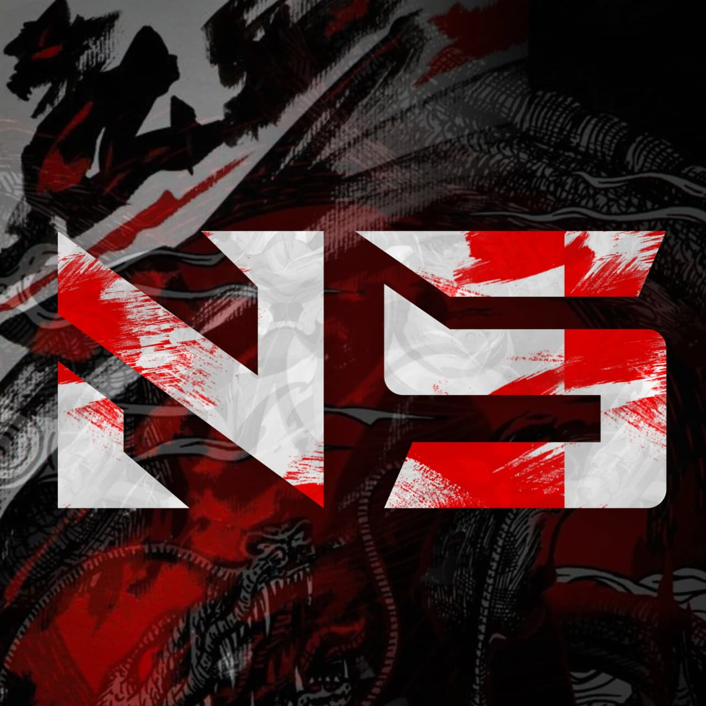
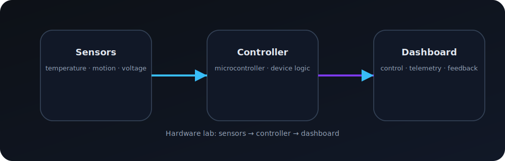

# Naboraj Sarkar — Active Learning Lab

<div align="center">
  
</div>

<div align="center" style="margin: 1rem 0;">
  
</div>

<p align="center">
  <strong>Learning by building. Testing ideas. Understanding systems.</strong>
</p>

<div align="center" style="max-width: 820px; margin: 1rem auto 2rem auto; padding: 1.1rem 1.2rem; border-radius: 20px; background: rgba(15, 23, 42, 0.05); border: 1px solid rgba(124, 58, 237, 0.18);">
  <p style="margin: 0 0 0.7rem 0; font-size: 1rem; font-weight: 700; color: #111;">About the journey</p>
  <p style="margin: 0 0 1rem 0; color: #333; line-height: 1.6;">This repo is the digital home for my learning in public journey, automation experiments, hardware prototypes, and developer portfolio. It shows the moments when I chose to learn faster, build stronger, and share honestly.</p>
  <p style="margin: 0 0 1rem 0; color: #333; line-height: 1.6;"><strong>Read my life story, explore the lab, or connect through the full social hub.</strong></p>
  <p style="margin: 0;">
    <a href="ABOUT.md"></a>
    <a href="socials.md"></a>
  </p>
</div>

<p align="center">
  <a href="https://github.com/naborajs"></a>
  
  
  
</p>

<div align="center" style="margin-top: 1rem; padding: 1rem; border: 1px solid #444; border-radius: 18px; background: rgba(124, 58, 237, 0.08); max-width: 760px;">
  <p style="margin: 0 0 0.6rem 0; font-weight: 700; color: #111;">Premium Contact & Social Hub</p>
  <p style="margin: 0 0 0.8rem 0; color: #333;">Open the full connection page for GitHub, messaging, channels, and community access.</p>
  <a href="socials.md"></a>
</div>

---

## What this lab shows

- **Active learning** through experiments, prototypes, and iterations
- **Engineering practice** with automation, APIs, and system design
- **Visible progress** through diagrams, logs, and project summaries

> Learn → Test → Build → Repeat

---

## Now learning

- Directing AI agents to build complex workflows
- Cybersecurity basics and system defense
- Physics and maths to sharpen reasoning
- Critical thinking: slowing down and questioning assumptions
- System architecture, request flow, and integration design

---

## Active maintenance & experiments

<div align="center">
  
</div>

| Project | Why it matters | Stack |
| --- | --- | --- |
| **Birthday Bloom** | Active open source repo (21+ stars), managing PRs and docs | React · Vite |
| **Ghost Engine v5** | Cross-platform TOR proxy and IP rotation toolkit | Toolkit |
| **Life Logger** | Telegram → Git logging, audit-ready automation | Python · Node.js · GitHub API · webhooks |
| **Auto Contribution Bot** | GitHub Actions and repo workflow automation | GitHub Actions · scripting · CI/CD |
| **CODE** | Browser IDE prototype for AI-assisted development | JavaScript · AI APIs · tooling |
| **NS Fin** | Finance dashboard with research-focused data flows | APIs · visualization · analytics |

---

## System playground

<div align="center">
  
</div>

```text
Browser → Server → API → Device → Feedback
```

### Ideas in motion

- Smart Device Dashboard
- Experiment Control Panel
- Hardware + Software Bridge
- AI + Automation Lab
- Learning Sandbox

---

## Hardware exploration

<div align="center">
  
</div>

- device communication and sensor telemetry
- basic electronics, signal mapping, and control loops
- building small IoT concepts with web interfaces

---

## AI & automation

<div align="center">
  
</div>

<div align="center">
  
</div>

- automation flow: trigger, parse, commit, monitor
- AI flow: input, orchestration, output
- focus on real behavior over polished stories

---

## Build log

- **Recent**: Shifted from building solo projects to maintaining open source (Birthday Bloom, Ghost Engine v5).
- **Current**: Directing AI agent workflows and starting a new track in cybersecurity.
- **Focus**: Studying physics, maths, and critical thinking. Questioning assumptions before I ship code.

---

## What changed recently

- removed old duplicate documentation
- centralized learning and experiment notes into a single portfolio
- upgraded README with visual storytelling and system cards
- added real architecture visuals for automation and hardware

---

## Community signal

> “This repo is a public lab of honest learning, practical automation, and real hardware experiments.”

- learning in public with visible progress
- open experiments that invite feedback and improvement
- designed for practical use, not just polished examples

---

## Future concepts

- Smart Device Dashboard with real-time controls
- Experiment Control Panel for simulation and replay
- Hardware + Software Bridge for sensor-driven apps
- AI + Automation Lab with chaining and observability
- Learning Sandbox for repeatable experiments

---

## Failures & lessons

- not every experiment is a finished project
- broken automations reveal assumptions faster than success
- hardware timing issues require data validation and buffering
- public learning is stronger when failures are documented

---

## Learning timeline

<div align="center">
  
</div>

- **Explore**: build systems, not only features
- **Prototype**: test quickly with real inputs
- **Deploy**: make workflows observable and stable
- **Improve**: learn from usage and failures
- **Scale**: move from demos to architecture

> See the full timeline in [LEARNING_TIMELINE.md](LEARNING_TIMELINE.md)

---

## Stats

| Metric | Value |
| --- | --- |
| GitHub repo | `naborajs/who-is-naboraj-sarkar` |
| Last commit |  |
| Followers |  |
| License |  |

---

## Connect

| Channel    | Handle                                             |
| ------------| ----------------------------------------------------|
| GitHub     | [@naborajs](https://github.com/naborajs)           |
| Telegram   | [@Nishantsarkar10k](https://t.me/Nishantsarkar10k) |
| Email      | msg@naborajs.me                                                  |
| WhatsApp   | +91 8900653250                                     |
| Social Hub | [All public platforms](socials.md)                 |

---

## Keywords

developer portfolio · student developer journey · learning in public · automation experiments · hardware prototypes · AI workflows · system architecture · open source learning

---

## Note

Learn. Test. Build. Repeat.
