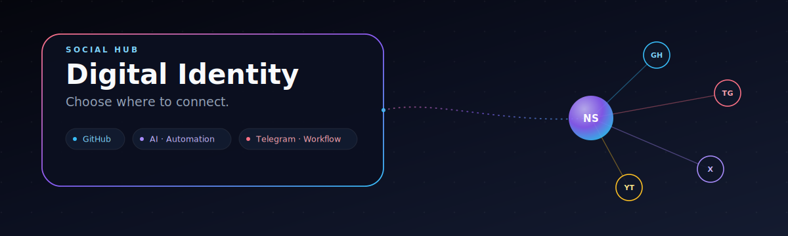

# Socials Hub

  

  <strong>Choose where to connect.</strong>

---

## Digital identity

| Name | Nickname | Location |
| --- | --- | --- |
| **Naboraj Sarkar** | Nishant Sarkar | Siliguri, West Bengal, India |

**Short bio:** Student Developer • Learning in Public • Building Systems • Exploring AI, Automation & Engineering

---

## Quick connect

  
  
  

---

## Social directory

| Platform         | Link                                                                                                   | Why it matters                         |
| ------------------| --------------------------------------------------------------------------------------------------------| ----------------------------------------|
| GitHub           | [github.com/naborajs](https://github.com/naborajs)                                                     | Source, projects, open source activity |
| Email            | [nishant.ns.business@gmail.com](mailto:nishant.ns.business@gmail.com)                                  | Business inquiries and collaboration   |
| Instagram        | [instagram.com/naborajs](https://instagram.com/naborajs)                                               | Visual project snippets and updates    |
| YouTube          | [youtube.com/@Nishant_sarkar](https://youtube.com/@Nishant_sarkar)                                     | Learning experiments and walkthroughs  |
| X (Twitter)      | [x.com/ItsNaborajs](https://x.com/ItsNaborajs)                                                        | quick engineering updates              |
| X (Twitter)      | [x.com/naboraj-sarkar](https://x.com/naboraj-sarkar)                                                   | alternate developer feed               |
| Telegram         | [t.me/Nishantsarkar10k](https://t.me/Nishantsarkar10k)                                                 | personal chat and demos                |
| Telegram Channel | [t.me/nsgamming69](https://t.me/nsgamming69)                                                           | community updates and experiments      |
| WhatsApp Channel | [whatsapp.com/channel/0029Vb4QTP7GE56sVeiOJJ1i](https://whatsapp.com/channel/0029Vb4QTP7GE56sVeiOJJ1i) | urgent channel updates                 |
| LinkedIn         | [linkedin.com/in/naboraj-sarkar](https://linkedin.com/in/naboraj-sarkar)                               | professional network and portfolio     |
| Discord          | [discord.gg/eRnfcBuv5v](https://discord.gg/eRnfcBuv5v)                                                 | community chat and feedback            |
| Reddit           | [reddit.com/u/naborajs](https://reddit.com/u/naborajs)                                                 | discussion and idea sharing            |

---

## Activity sections

### Digital presence

- GitHub: project updates, open source experiments, repository work
- LinkedIn: professional context, roles, and connection requests
- X: short updates, engineering notes, and lab progress

### Community channels

- Telegram: fast demos and direct support
- WhatsApp: broadcast updates, channel announcements
- Discord: chat-based discussion and feedback loops

### Creative channels

- YouTube: recorded walkthroughs, project demos, and learning sessions
- Instagram: short visual experiments, UI ideas, and design concepts
- Reddit: open threads for discussion and discovery

---

## Contact section

  

  
  
<small>Scan to open GitHub on mobile.</small>

---

## Digital presence

- Developer portfolio and open source work
- Automation experiments and AI prototypes
- Systems thinking, workflows, and hardware exploration

---

## SEO & discovery

Keywords: developer, portfolio, social links, github, automation, student developer, open source

This page is intended to be the single source of truth for public platforms and contact pathways.

---

## Footer

> A professional digital identity page for Naboraj Sarkar — a developer who chooses learning, testing, and building publicly.
